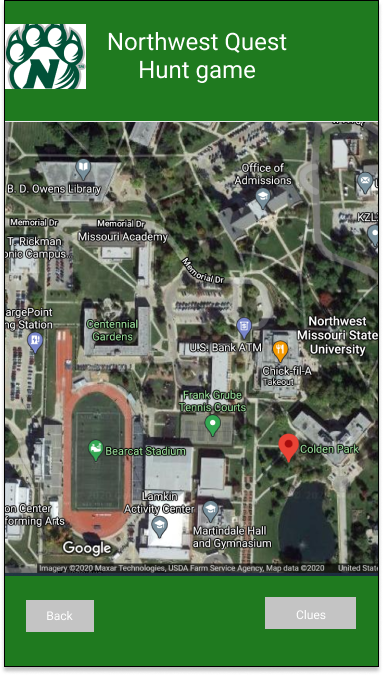

# Northwest Gaming Appplication

## Project Charter

This is the project charter for the Northwest Gaming Application. This Application will be developed as a Progressive Web application.

## Project Purpose:
This is a mobile gaming application which enables the players(users of this game) to complete a quest which is finding out specific set of location based on the clues provided. This is a fun game aimed at involving the students at Northwest Missouri State University to make their respective teams and participate in the competition to score maximum points based on the level of the difficulty. As we all know due to the ongoing pandemic it is really difficult to get together a group of people but this game will provide the paltform to get along  and meeting new people while still maintaining the social distancing. This also helps the students in improving the mental and physical fitness as the clues will be tricky a person has to walk/jog/run(depends on the interest of the person) to these locations. 

## Team members

<table class="tg">
<thead>
  <tr>
    <th class="tg-0lax">Name of the team member</th>
    <th class="tg-0lax">Roles</th>
    <th class="tg-0lax">Contact Information</th>
  </tr>
</thead>
<tbody>
  <tr>
    <td class="tg-0lax">Vikas Baswapuram</td>
    <td class="tg-0lax">Database Engineer</td>
    <td class="tg-0lax">s538336@nwmissouri.edu</td>
  </tr>
  <tr>
    <td class="tg-0lax">Rohith Reddy Avisakula</td>
    <td class="tg-0lax">Team Leader</td>
    <td class="tg-0lax">s538294@nwmissouri.edu</td>
  </tr>
  <tr>
    <td class="tg-0lax">Rajashekar Gande</td>
    <td class="tg-0lax">Full Stack Developer</td>
    <td class="tg-0lax">s538099@nwmissouri.edu</td>
  </tr>
  <tr>
    <td class="tg-0lax">Sumanth Reddy Naidu</td>
    <td class="tg-0lax">Back end Developer</td>
    <td class="tg-0lax">s538359@nwmissouri.edu</td>
  </tr>
  <tr>
    <td class="tg-0lax">Sumana Reddy Reddybathula</td>
    <td class="tg-0lax">Project Manager</td>
    <td class="tg-0lax">s538360@nwmissouri.edu</td>
  </tr>
  <tr>
    <td class="tg-0lax">pooja gundu</td>
    <td class="tg-0lax">UI Developer</td>
    <td class="tg-0lax">s538295@nwmissouri.edu</td>
  </tr>
</tbody>
</table>

## Mentor/ Client Description:
- Dr. Denise Case
- Assistant Professor,Northwest Missouri State University
- 44-691 Graduate Directed Project 
- Fall 2020

## Coach Consultant

- Dr. Charles Hoot
- Assistant Professor,School of Computer Science and Information Systems

## ER Diagram

## Game assumptions for the ERD:

# USER REGISTRATION AND TEAM CRITERIA:

- Any person with the valid email id can register for the game. They can also save a nickname of their choice for their userid. 
- The user can create a team or send an invite to join a team. The user can also accept or reject the invites they might get from the teams to join them.
- If the user creates a team then that user serves as the captain for that team and can send invites to other players to join the team he/she created.
- The hunt master will be only one person and he/she will also to register i.e the hunt master is also a user but will be given previlages to access the create quest page. 
- This is done by making sure we identify the hunt master prior to the realease of the game and store that person's id as the huntmaster which will enable them to access the create quest page.

# QUESTS, LOCATIONS AND COMPETITION:

- A quest will have set of location coordinates. The first location coordinates will be displayed to the user if they crack the clue given to them initially. Once that person reaches the location after unlocking the coordinates he will get next clue for the next location.
- This goes on till all the locations have been identified and claimed.
- The series of quests/quest created are grouped together and is added to competition where each competition will have a unique name, start date and end date.
- Once the start date is confirmed and entered a notification is sent to all the users about this.

# SCORING:

- The scoring is given to individuals once they have reached the location. The first individual to reach there will get the maximum points. The next individual to get to the location cannot get the maximum points but will be awarded with a decrement of 10% of the max points and this goes on till the 50% and if there are still players left they will also be warded 50% of the points.
- The team score is total sum of all the individual player scores. The team who finishes finding all the locations fisrt will be awarded bonus points. Only one will get the bonus and no other team can get it.
- The No of persons per team will be limited to a maximum of 4 players and a minimum of 1 player thus giving a chance to form more teams and making the competition and the leaderboard interesting.

# GENERAL RULES:

- The user can join any team only upon approval from the team captain. But if they wish to leave approval is not required.
- Once a team enters a competition with full capacity then no player from that team can leave the team until the competition ends. 
- If the team is not full then they can add a player till the team reaches its maximum capacity. 
- The team with maximum score at the end of the competition will win the competition.
- If there are multiple competitions going on at the same then teams can participate all the competitions that are open if they wish to.

## User Entity
- Any person with a valid email and wishes to register for the game is defined as user.
- An entity is a general type for objects relevant to our game. Entities can represent objects that are crucial to gameplay, such as player and enemy characters, or objects that merely exist in the game world without interacting with the player, such as animated decorations in a level.

## Player Entity
- A Player is a user who is already registered.
- Nick name is also inluded.

## Team Entity
- A team is defined by the group of players and one of the palyer acts as the captain/teamleader.

## Quest Entity
- The quest is decided by the hunt master and is limited by time constraint.

## Location Entity
- This entity is comprised of location coordinates and is given by the huntmaster for the players to locate.

## Competition Entity
- This is conducted by the huntmaster and the team with maximum points wins the competition.

## Sample Data/Demo chart of Application

## Schedule Management

<table class="tg">
<thead>
  <tr>
    <th class="tg-0lax">WBS NO.</th>
    <th class="tg-0lax">TASK NAME</th>
    <th class="tg-0lax">STATUS</th>
    <th class="tg-0lax">DURATION in hrs</th>
  </tr>
</thead>
<tbody>
  <tr>
    <td class="tg-0lax"><b>1</b></td>
    <td class="tg-0lax"><b>Sprint 0<b></td>
    <td class="tg-0lax"><b>-</b></td>
    <td class="tg-0lax"><b>200</b></td>
  </tr>
  <tr>
    <td class="tg-0lax">1.1</td>
    <td class="tg-0lax">User stories prioritization</td>
    <td class="tg-0lax">Done</td>
    <td class="tg-0lax">25</td>
  </tr>
  <tr>
    <td class="tg-0lax">1.2</td>
    <td class="tg-0lax">ER-Diagram development</td>
    <td class="tg-0lax">Done</td>
    <td class="tg-0lax">25</td>
  </tr>
  <tr>
    <td class="tg-0lax">1.3</td>
    <td class="tg-0lax">Sample data</td>
    <td class="tg-0lax">Done</td>
    <td class="tg-0lax">25</td>
  </tr>
  <tr>
    <td class="tg-0lax">1.4</td>
    <td class="tg-0lax">Schedule management plan</td>
    <td class="tg-0lax">In-progress</td>
    <td class="tg-0lax">25</td>
  </tr>
  <tr>
    <td class="tg-0lax">1.5</td>
    <td class="tg-0lax">Cost estimation</td>
    <td class="tg-0lax">Done</td>
    <td class="tg-0lax">20</td>
  </tr>
  <tr>
    <td class="tg-0lax">1.6</td>
    <td class="tg-0lax">Proposed UI screens development</td>
    <td class="tg-0lax">In-progress</td>
    <td class="tg-0lax">30</td>
  </tr>
  <tr>
    <td class="tg-0lax">1.7</td>
    <td class="tg-0lax">Jira setups</td>
    <td class="tg-0lax">Done</td>
    <td class="tg-0lax">24</td>
  </tr>
  <tr>
    <td class="tg-0lax">1.8</td>
    <td class="tg-0lax">User authorization</td>
    <td class="tg-0lax">Done</td>
    <td class="tg-0lax">26</td>
  </tr>
  <tr>
    <td class="tg-0lax"><b>2</b></td>
    <td class="tg-0lax"><b>Sprint 1</b></td>
    <td class="tg-0lax"><b>-</b></td>
    <td class="tg-0lax"><b>200</b></td>
  </tr>
  <tr>
    <td class="tg-0lax">2.1</td>
    <td class="tg-0lax">Sprint 1 planning</td>
    <td class="tg-0lax">To-Do</td>
    <td class="tg-0lax">35</td>
  </tr>
  <tr>
    <td class="tg-0lax">2.2</td>
    <td class="tg-0lax">Sprint 1 execution</td>
    <td class="tg-0lax">To-Do</td>
    <td class="tg-0lax">35</td>
  </tr>
  <tr>
    <td class="tg-0lax">2.3</td>
    <td class="tg-0lax">Sprint 1 Demo and User authorization</td>
    <td class="tg-0lax">To-Do</td>
    <td class="tg-0lax">35</td>
  </tr>
  <tr>
    <td class="tg-0lax">2.4</td>
    <td class="tg-0lax">Sprint 1 implementation</td>
    <td class="tg-0lax">To-Do</td>
    <td class="tg-0lax">45</td>
  </tr>
  <tr>
    <td class="tg-0lax">2.5</td>
    <td class="tg-0lax">MVP 1 release</td>
    <td class="tg-0lax">To-Do</td>
    <td class="tg-0lax">50</td>
  </tr>
  <tr>
    <td class="tg-0lax"><b>3</b></td>
    <td class="tg-0lax"><b>Sprint 2</b></td>
    <td class="tg-0lax"><b>-</b></td>
    <td class="tg-0lax"><b>200</b></td>
  </tr>
  <tr>
    <td class="tg-0lax">3.1</td>
    <td class="tg-0lax">Sprint 2 planning</td>
    <td class="tg-0lax">To-Do</td>
    <td class="tg-0lax">35</td>
  </tr>
  <tr>
    <td class="tg-0lax">3.2</td>
    <td class="tg-0lax">Sprint 2 execution</td>
    <td class="tg-0lax">To-Do</td>
    <td class="tg-0lax">35</td>
  </tr>
  <tr>
    <td class="tg-0lax">3.3</td>
    <td class="tg-0lax">Sprint 2 Demo and User authorization</td>
    <td class="tg-0lax">To-Do</td>
    <td class="tg-0lax">35</td>
  </tr>
  <tr>
    <td class="tg-0lax">3.4</td>
    <td class="tg-0lax">Sprint 2 implementation</td>
    <td class="tg-0lax">To-Do</td>
    <td class="tg-0lax">45</td>
  </tr>
  <tr>
    <td class="tg-0lax">3.5</td>
    <td class="tg-0lax">MVP 2 release</td>
    <td class="tg-0lax">To-Do</td>
    <td class="tg-0lax">50</td>
  </tr>
  <tr>
    <td class="tg-0lax"><b>4</b></td>
    <td class="tg-0lax"><b>Sprint 3</b></td>
    <td class="tg-0lax"><b>-</b></td>
    <td class="tg-0lax"><b>200</b></td>
  </tr>
  <tr>
    <td class="tg-0lax">4.1</td>
    <td class="tg-0lax">Sprint 3 planning</td>
    <td class="tg-0lax">To-Do</td>
    <td class="tg-0lax">35</td>
  </tr>
  <tr>
    <td class="tg-0lax">4.2</td>
    <td class="tg-0lax">Sprint 3 execution</td>
    <td class="tg-0lax">To-Do</td>
    <td class="tg-0lax">35</td>
  </tr>
  <tr>
    <td class="tg-0lax">4.3</td>
    <td class="tg-0lax">Sprint 3 Demo and User authorization</td>
    <td class="tg-0lax">To-Do</td>
    <td class="tg-0lax">35</td>
  </tr>
  <tr>
    <td class="tg-0lax">4.4</td>
    <td class="tg-0lax">Sprint 3 implementation</td>
    <td class="tg-0lax">To-Do</td>
    <td class="tg-0lax">45</td>
  </tr>
  <tr>
    <td class="tg-0lax">4.5</td>
    <td class="tg-0lax">MVP 3 release</td>
    <td class="tg-0lax">To-Do</td>
    <td class="tg-0lax">50</td>
  </tr>
  <tr>
    <td class="tg-0lax"><b>5</b></td>
    <td class="tg-0lax"><b>Sprint 4 (GDP 2) all sprints</b></td>
    <td class="tg-0lax"><b>-</b></td>
    <td class="tg-0lax"><b>600</b></td>
  </tr>
  <tr>
    <td class="tg-0lax">5.1</td>
    <td class="tg-0lax">Sprint 4 planning</td>
    <td class="tg-0lax">To-Do</td>
    <td class="tg-0lax">100</td>
  </tr>
  <tr>
    <td class="tg-0lax">5.2</td>
    <td class="tg-0lax">Sprint 4 execution</td>
    <td class="tg-0lax">To-Do</td>
    <td class="tg-0lax">140</td>
  </tr>
  <tr>
    <td class="tg-0lax">5.3</td>
    <td class="tg-0lax">Sprint 4 Demo and User authorization</td>
    <td class="tg-0lax">To-Do</td>
    <td class="tg-0lax">140</td>
  </tr>
  <tr>
    <td class="tg-0lax">5.4</td>
    <td class="tg-0lax">Sprint 4 implementation</td>
    <td class="tg-0lax">To-Do</td>
    <td class="tg-0lax">115</td>
  </tr>
  <tr>
    <td class="tg-0lax">5.5</td>
    <td class="tg-0lax">MVP 4 release</td>
    <td class="tg-0lax">To-Do</td>
    <td class="tg-0lax">105</td>
  </tr>

</tbody>
</table>

## Updated Cost Estimate 

|                                    PROJECT   COST ESTIMATE  |                                        |             |                   |                 |                       |   |
|-------------------------------------------------------------|----------------------------------------|-------------|-------------------|-----------------|-----------------------|---|
|                                                             | PROJECT TITLE                          |             |                   |                 |                       |   |
|                                                             |       Northwest Gaming Application     |             |                   |                 |                       |   |
|                                                             |                                        |             |                   |                 |                       |   |
|                           WBS NO.                           |                 TASK NAME              |    STATUS   | DURATION in hours | TOTAL TEAM COST | TOTAL COST PER   WEEK |   |
|                              1                              |                 Sprint 0               |             |        200        |                 |                
|                             1.1                             |   User stories prioritization          |     Done    |         25        |      $350       |        $8,750         |   |
|                             1.2                             |   ER-Diagram development               |     Done    |         25        |      $350       |        $8,750         |   |
|                             1.3                             |   Sample data                          |     Done    |         25        |      $350       |        $8,750         |   |
|                             1.4                             |   Schedule management plan             | In-progress |         25        |      $350       |        $8,750         |   |
|                             1.5                             |   cost estimation                      |     Done    |         20        |      $350       |        $7,000         |   |
|                             1.6                             |   proposed UI screens development      | In-progress |         30        |      $350       |        $10,500        |   |
|                             1.7                             |   Jira setups                          |     Done    |         24        |      $350       |        $8,400         |   |
|                             1.8                             |   User authorization                   |     Done    |         26        |      $350       |        $9,100         |   |
|                              2                              |                Sprint   1              |             |        200        |                 |              
|                             2.1                             |   Sprint 1 planning                    |    To-Do    |         35        |      $350       |        $12,250        |   |
|                             2.2                             |   Sprint 1 execution                   |    To-Do    |         35        |      $350       |        $12,250        |   |
|                             2.3                             |   Sprint 1 Demo and user authorization |    To-Do    |         35        |      $350       |        $12,250        |   |
|                             2.4                             |   Sprint 1 implementation              |    To-Do    |         45        |      $350       |        $15,750        |   |
|                             2.5                             |   MVP 1 release                        |    To-Do    |         50        |      $350       |        $17,500        |   |
|                              3                              |                Sprint   2              |             |        200        |                 |              
|                             3.1                             |   Sprint 2 planning                    |    To-Do    |         35        |      $350       |        $12,250        |   |
|                             3.2                             |   Sprint 2 execution                   |    To-Do    |         35        |      $350       |        $12,250        |   |
|                             3.3                             |   Sprint 2 Demo and user authorization |    To-Do    |         35        |      $350       |        $12,250        |   |
|                             3.4                             |   Sprint 2 implementation              |    To-Do    |         45        |      $350       |        $15,750        |   |
|                             3.5                             |   MVP 2 release                        |    To-Do    |         50        |      $350       |        $17,500        |   |
|                              4                              |                Sprint   3              |             |        200        |                 |               
|                             4.1                             |   Sprint 3 planning                    |    To-Do    |         35        |      $350       |        $12,250        |   |
|                             4.2                             |   Sprint 3 execution                   |    To-Do    |         35        |      $350       |        $12,250        |   |
|                             4.3                             |   Sprint 3 Demo and user authorization |    To-Do    |         35        |      $350       |        $12,250        |   |
|                             4.4                             |   Sprint 3 implementation              |    To-Do    |         45        |      $350       |        $15,750        |   |
|                             4.5                             |   MVP 3 release                        |    To-Do    |         50        |      $350       |        $17,500        |   |
|                              4                              |            Sprint   4 (GDP-2)          |             |        200        |                 |               
|                             4.1                             |   Sprint 4 planning                    |    To-Do    |         35        |      $350       |        $12,250        |   |
|                             4.2                             |   Sprint 4 execution                   |    To-Do    |         35        |      $350       |        $12,250        |   |
|                             4.3                             |   Sprint 4 Demo and user authorization |    To-Do    |         35        |      $350       |        $12,250        |   |
|                             4.4                             |   Sprint 4 implementation              |    To-Do    |         45        |      $350       |        $15,750        |   |
|                             4.5                             |   MVP 4 release                        |    To-Do    |         50        |      $350       |        $17,500        |   |
|                                                             |     TOTAL PROJECT COST                 |             |                   |                 |        $350,000        |

- The team cost per hour is $350.
- The developers required for this application is 6.
- The estimated total cost for this application is $350,000 as mentioned in the cost estimation table.

## Risks and Challenges:
- The app is based on the locations and to find the location accurately GPS is to be used which could a challenging and tricky task.
- This game is based on finding the locations which are outdoor and given the present scenario social distancing must be followed to play this game.
- The specification of the location coordinates in the game is also a challenging part.
- Handling data will be a issue here as any player can leave and join a new team whenever he desires to. This will make the desiging the database a difficult task.

## Advantages:
- This game helps the players in physical activity as the players have to walk around to find the locations.
- This also helps the players to build the healthy competition thereby bringing the people together.

## Technology Stack:
- THis is going to be a Progressive Web Application.
- HTML.
- CSS/Bootstrap.
- JavaScript.

## Acceptance Criteria:

- Each player must have a smart phone or a PC.
- Should be able to plan the route using location.
- One must have some knowledge to accumulate the clues and reach the treasure.

## User Stories:

## Sprint - 1
# User Story - 1
As a User I want to login/Signup for the game.
# Acceptance criteria:
The User should have a valid email Id to Signup for the game.
Upon signing up for the game the user will be prompted to enter a username/nickname of his choice.
If the entered username/nickname is alraedy taken then he will prompted the same and after this point he will bee identified as a player.
If the user has already signed up for the game he can login with the username and password.
The user Id should be persisted in the database along with the user's info when completing the registration.

# User Story - 2
As a user I want to create a team.
# Acceptance Criteria:
The User can create a team upon signing up and he will prompted to enter a team name.
The user who creates a team will serve as the captain.
The user Id of this person  and the info the team should be added into the database as the captain and should be retrievable whenever required. 

# User Story - 3
As a User I want to Join a Team.
# Acceptance Criteria:
The User can join any team he wishes to and will have to search for the team name he wants to join.
Once he decides a team to join he will have to send a request to join their team.
The user should be able to access all the teams available for him to join.

# User Story - 4
As a User(captain) I want to accept/decline an invite of a player.
# Acceptance Criteria:
The user can accept/decline an invite of another player after looking up his invitation.
The request should be visible in the notifications to the team/team captain.

# User Story - 5
As a user I want to act as the huntmaster and create quest.
# Acceptance Criteria:
The user who is hunt master will be able to create quests.
The huntmaster is assigned to only one person and the userid and other info is stored in the database such that only he can access the page of the create quest.

# User story - 6
As a User(huntmaster) I want to add multiple locations in a single quest.
# Acceptance Criteria:
The user can add multiple locations in creating a quest page.
The locations added can be only be accessed after decoding the clue and only one location has to be released and once that person reaches that location then the clue for the next location is to be displayed from the database and so on until all the locations are finished.

# User Story - 7
As a User, I want to join a competition.
# Acceptance Criteria:
The user can join a competition when the competition starts.
Once the competition is open, teams which are stored in the database should be able to join the competition. If a new team is formed after the start date of the competition they should still be able to join the competition until and unless the competition is closed.

# User Story - 8
As a User, I want to join a competition when it starts.
# Acceptance Criteria:
The user will get to know about the competition via notifications.
A notification is to be sent to all the users who have registered ids prior to the start of the competition.

## Sprint - 2
# User Story - 9
As a User I want to know about the scoring details of the competition.
# Acceptance Criteria:
The user can look at the info about the scoring in the about page.
An about page is to created for the users and the information regarding the competition and its scoring details are to be mentioned in it.

# User Story - 10
As a User I want to look at the points scored by the team.
# Acceptance Criteria:
The user can access this detail on the leaderboard page.
A leaderboard page is to be created and the points scored by the team are to displayed in the descending order i.e the team with the highest points should be displayed with team name and their points on the top indicating that they are in the first position.

# User Story - 11
 As a Team the schedule for the MVP releases are set.
# Acceptance Criteria:
The shedule is decided and developers start working based on the requirements.

## Sprint - 3( Scheduled  for the GDP-2)
# UI development finalisation
# BackEnd development
# Testing the application
# Deployment of the application

## Rapid MVP Team Links

- Jira : [jira Link](https://vikasbaswapuram.atlassian.net/secure/RapidBoard.jspa?rapidView=1&projectKey=NGA&selectedIssue=NGA-1)

## proposed screens : 
# Home page: 
This emphasises the color of our college.

# Leaderboard Page:
This the page where the points earned by different teams are displayed(Highest points to lowest points)

# Quest Creation Page: This is the page where the Hunt master creates a new quest. 

# Challenges Page:
This is the page where all the challenges are displayed for the teams to participate.

# Settings Page:
This is the page where user's profile can be edited, about, help and logout options are provided.

# Game Page:
This is the page where the user can be able to view the map of Northwest Missouri state University and can be able to access the clues.

## Jira screenshot : 

## Original RFP:
[RFP](https://github.com/denisecase/rfp-hunt/blob/master/rfp-hunt.md)

## References:
- [Youtube](https://www.youtube.com/watch?v=DO9ZRo2jU3w)
- [Markdown Syntax](https://www.markdownguide.org/cheat-sheet/)
- [RFP](https://clearbridgemobile.com/how-to-write-an-amazing-mobile-app-rfp/)
